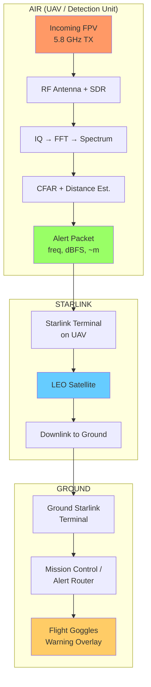

# Pipeline: Incoming FPV Detection → Starlink → Flight Goggles

End-to-end flow from RF detection of an incoming FPV drone to the operator seeing the alert on flight goggles.

---

## High-Level Flow

```
┌─────────────────────────────────────────────────────────────────────────────────────────┐
│  AIR (UAV / Detection Unit)                                                              │
│  ┌──────────────┐    ┌──────────────┐    ┌──────────────┐    ┌──────────────────────┐  │
│  │ Incoming FPV │───▶│ RF Antenna + │───▶│ SDR + Signal │───▶│ Alert + Telemetry    │  │
│  │ (5.8 GHz TX) │    │ SDR Receiver │    │ Processing   │    │ Packet Formation     │  │
│  └──────────────┘    └──────────────┘    └──────────────┘    └──────────┬───────────┘  │
└──────────────────────────────────────────────────────────────────────────┼──────────────┘
                                                                           │
                                                                           ▼
┌─────────────────────────────────────────────────────────────────────────────────────────┐
│  STARLINK                                                                                │
│  ┌──────────────┐    ┌──────────────┐    ┌──────────────┐                               │
│  │ Starlink     │───▶│ LEO Satellite│───▶│ Downlink to  │                               │
│  │ Terminal on  │    │ Relay        │    │ Ground       │                               │
│  │ UAV / Relay  │    │              │    │              │                               │
│  └──────────────┘    └──────────────┘    └──────┬───────┘                               │
└──────────────────────────────────────────────────────────────────────────┼──────────────┘
                                                                           │
                                                                           ▼
┌─────────────────────────────────────────────────────────────────────────────────────────┐
│  GROUND                                                                                  │
│  ┌──────────────┐    ┌──────────────┐    ┌──────────────────────┐                       │
│  │ Ground       │───▶│ Mission      │───▶│ Flight Goggles /     │                       │
│  │ Starlink     │    │ Control or   │    │ Operator Display     │                       │
│  │ Terminal     │    │ Alert Router │    │ (Warning Overlay)     │                       │
│  └──────────────┘    └──────────────┘    └──────────────────────┘                       │
└─────────────────────────────────────────────────────────────────────────────────────────┘
```

---

## Step-by-Step Pipeline

| Step | Stage | Description |
|------|-------|-------------|
| **1** | **Incoming FPV** | Hostile FPV (First Person View) drone transmits video/control on 5.8 GHz band. |
| **2** | **RF capture** | Omni + directional antennas on the detection UAV receive the signal. |
| **3** | **SDR acquisition** | SDR (e.g. PlutoSDR/AD9361) samples IQ, sweeps 5.6–6.0 GHz, produces spectrum. |
| **4** | **Signal processing** | FFT → CFAR/distance logic → detection decision + proximity estimate. |
| **5** | **Alert packet** | Form payload: freq, dBFS, distance, confidence, timestamp. |
| **6** | **Starlink uplink** | UAV’s Starlink terminal sends packet to LEO satellite. |
| **7** | **Satellite relay** | Starlink constellation relays to ground gateway. |
| **8** | **Ground downlink** | Operator’s Starlink terminal receives packet. |
| **9** | **Mission control** | Software routes alert to correct operator/session. |
| **10** | **Goggle overlay** | Alert injected into FPV goggle feed or companion display. |

---

## Mermaid Diagram



---

## Data Flow Summary

| From | To | Data |
|------|----|------|
| Incoming FPV | Antenna | 5.8 GHz RF |
| Antenna | SDR | IQ samples |
| SDR | Processor | Spectrum (dB per bin) |
| Processor | Alert packet | freq, signal dBFS, distance m, confidence |
| UAV | Satellite | Encrypted IP over Starlink |
| Satellite | Ground | Same |
| Ground | Goggles | Warning overlay (text/graphic) |

---

## Note on This Project

The `pluto_drone_detector` codebase implements **steps 3–4** (SDR acquisition and signal processing). Steps 1–2 assume an airborne RF setup; steps 5–10 assume integration with Starlink and mission control systems, which are outside this project’s scope.
