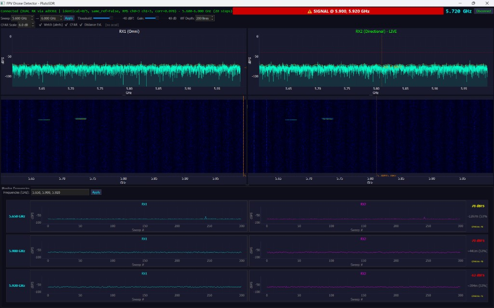
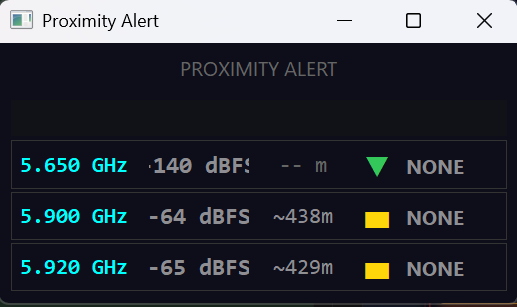

# FPV Drone Detector — Short Overview

A radio-based system that **detects nearby FPV (First Person View) drones** by listening for their video/control signals in the 5.8 GHz band. Built for PlutoSDR hardware, with a focus on **early warning** and **distance estimation**.

---

## What It Does

- **Detects** FPV drone transmissions in the 5.6–6.0 GHz range  
- **Estimates distance** to the drone (roughly how close it is in meters)  
- **Warns** when a drone is within ~100 m  
- **Shows signal trend** — whether the signal is getting stronger (approaching) or weaker (moving away)  
- **Runs a separate alert window** — a popup that stays visible for quick glances  

---

## Main Software



The main window shows:

| Feature | What it does |
|--------|--------------|
| **Spectrum** | Live view of radio energy across frequencies — spikes show active transmitters |
| **Waterfall** | Time history of the spectrum — helps spot when a drone appears or disappears |
| **Monitor channels** | Tracks specific frequencies (e.g. 5.65, 5.9, 5.92 GHz) with signal strength and distance |
| **Threshold & gain** | Adjust sensitivity — higher threshold = fewer false alarms, lower = more sensitive |
| **CFAR / Distance** | Smart detection that adapts to noise, plus distance estimation from signal strength |

---

## Alert Window



A separate window that pops up with:

| Feature | What it does |
|--------|--------------|
| **Per-channel status** | Each monitored frequency gets a row with signal level, distance, and trend |
| **Color coding** | Gray = no threat, yellow = detected, orange = approaching, red = critical (~100 m) |
| **Trend arrow** | ▲ rising (getting closer), ▬ stable, ▼ falling (moving away) |
| **Top banner** | Big warning when a drone is close or approaching |

Alerts only appear when a **real signal** is detected — noise does not trigger false alarms.

---

## Capabilities Summary

| Capability | Yes / No |
|------------|----------|
| Detect FPV drones in 5.8 GHz band | ✓ |
| Estimate distance (meters) | ✓ |
| Warn when drone is close (~100 m) | ✓ |
| Show if signal is rising or falling | ✓ |
| Dual antenna (omni + directional) | ✓ (if hardware supports it) |
| Adaptive detection (CFAR) | ✓ |
| Separate alert window | ✓ |
| Direction finding | ✗ (not yet) |

---

## Hardware

- **PlutoSDR** (or AD9361-based SDR) — USB or network connected  
- **Note:** Stock PlutoSDR is 325 MHz–3.8 GHz; for 5.8 GHz you need Pluto+ (AD9363) or a modified unit  

---

## Use Cases (Pitch-Ready)

- **Base / facility protection** — early warning when an FPV drone enters the area  
- **Event security** — monitor for unauthorized drone activity  
- **Research / training** — understand FPV signal behavior and detection limits  
- **Integration** — alert engine can feed into mission-control dashboards via WebSocket or embedded widget  

---

## Quick Start

```bash
pip install -r requirements.txt
python drone_detector_enhanced.py
```

1. Click **Connect**  
2. Set monitor frequencies (e.g. 5.650, 5.900, 5.920)  
3. Enable **Distance Est.** and **CFAR** for best results  
4. The alert window opens automatically — keep it visible for quick warnings  
